# DAADvisor

In this project, I collected data from daad.de through web scraping techniques and utilized it to create visualizations that offer valuable insights. The aim is to facilitate easier access to information on this site for international students seeking relevant details.

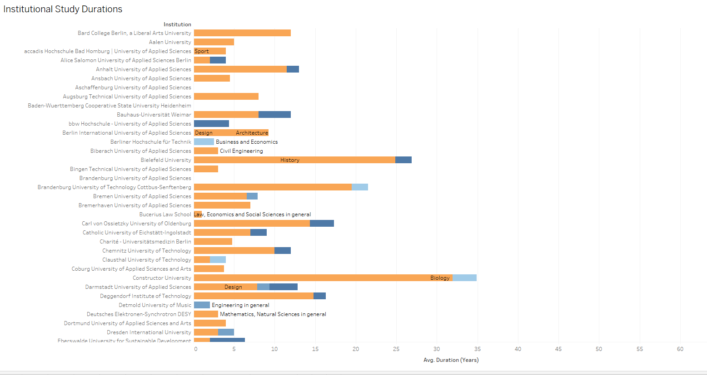
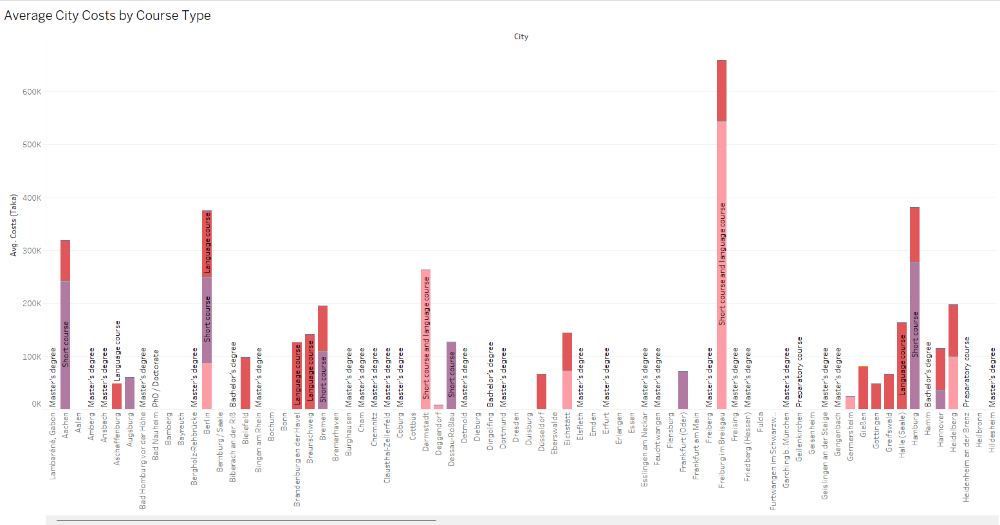
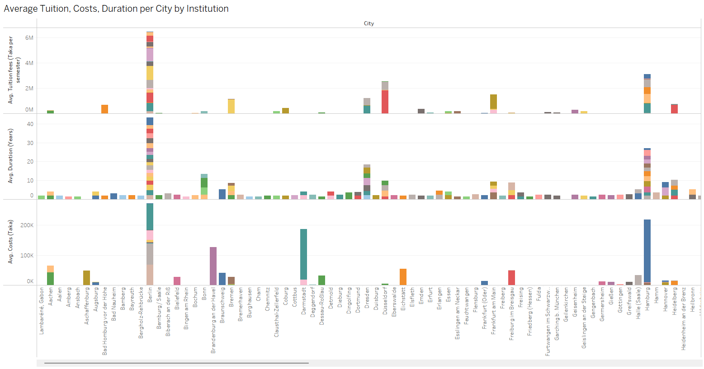
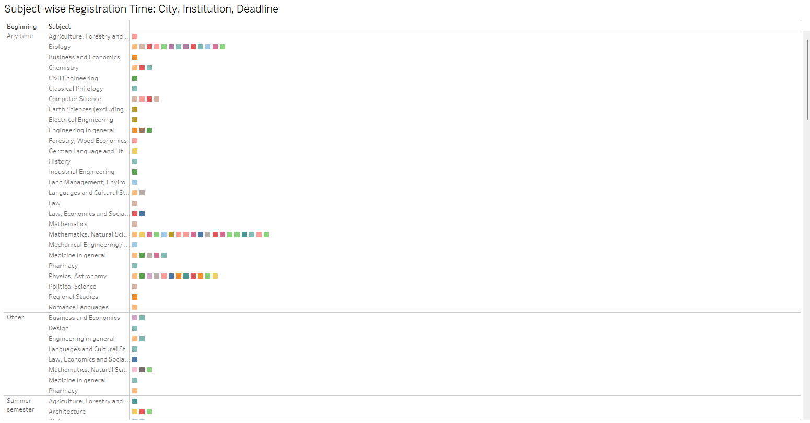
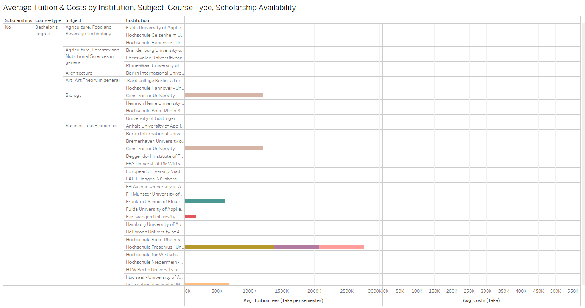
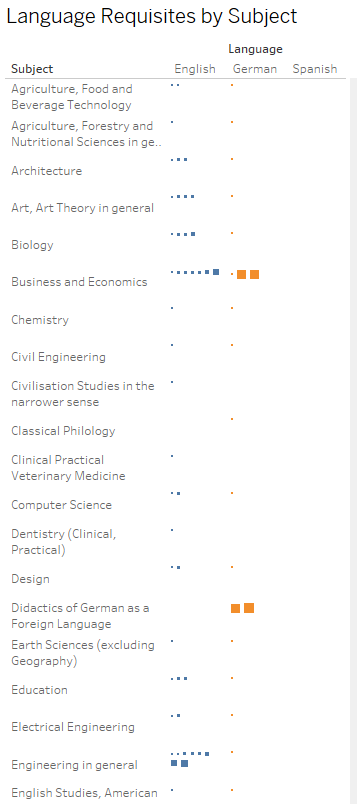
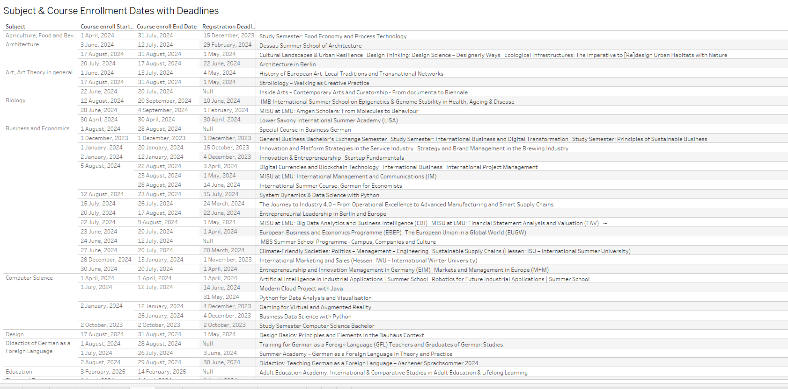
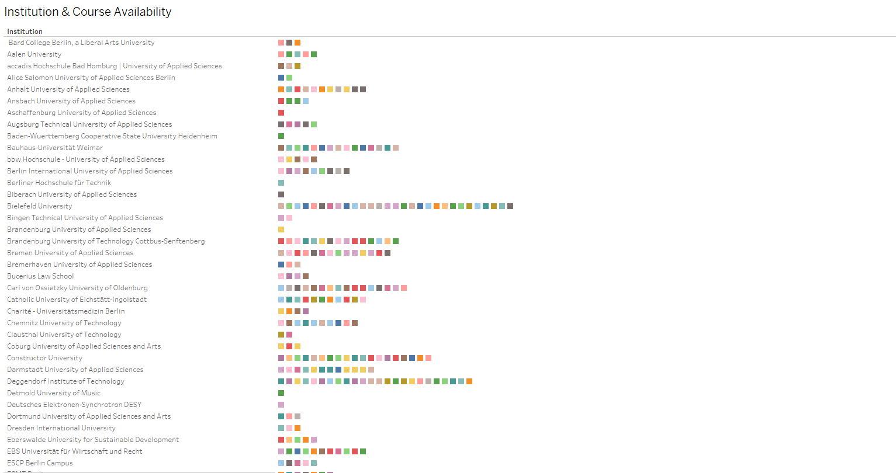
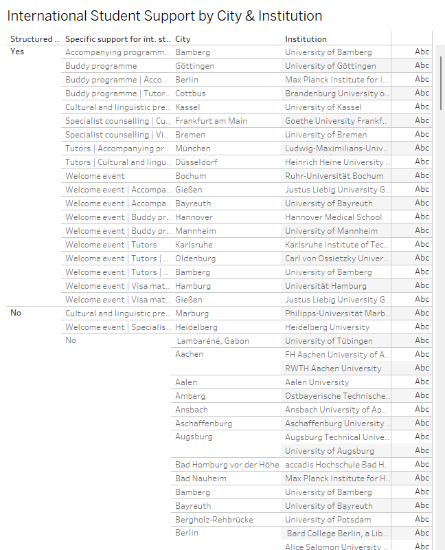
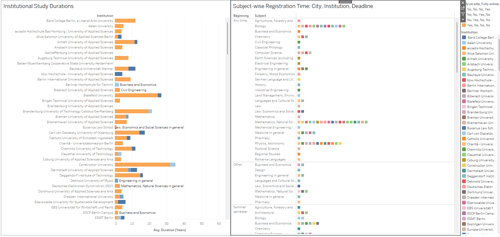
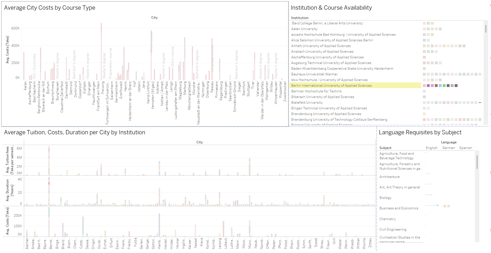

# Build From Sources and Run the Selenium Scraper

1. Clone the repo
~~~bash
git clone https://github.com/AnisTaluqdar/DAADvisor.git
~~~
2. Initialize and activate virtual environment (for linux)
~~~bash
python -m venv venv

cd venv

bin/activate 
~~~

3. Install dependencies
~~~bash
python -m pip install -r requirements.txt
~~~

4. Run for scrap the data from website
~~~bash
python Daad_Scraper/main.py
~~~

5. Run for data preprocessing
~~~bash
python Daad_Scraper/data_preprocessing.py
~~~

Tableau Public view: https://public.tableau.com/app/profile/anis.taluqdar/viz/DaadInternationalCourseInformation/Dashboard1

