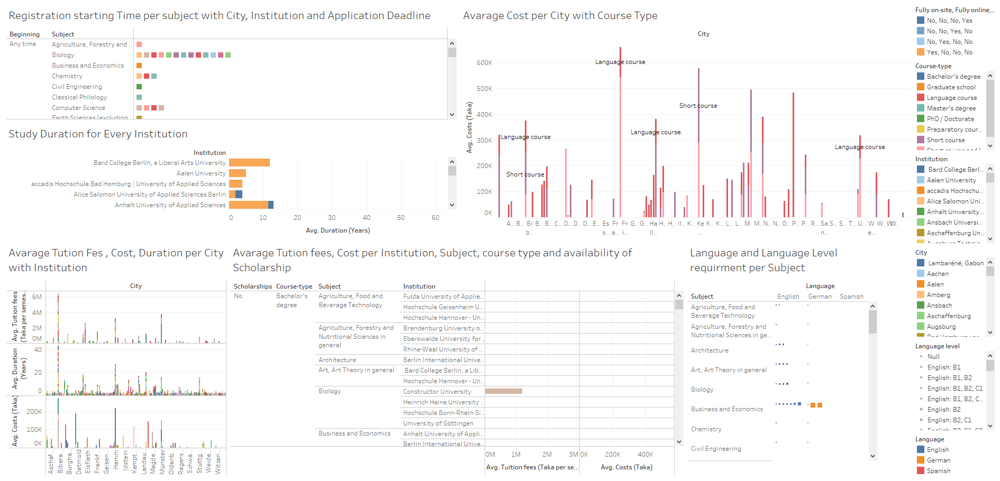

# Daad-International-Course-Information

1. Clone the repo
~~~bash
git clone https://github.com/AnisTaluqdar/Daad-International-Course-Information.git
~~~
2. Initialize and activate virtual environment (for linux)
~~~bash
python -m venv venv

cd venv

bin/activate 
~~~

3. Install dependencies
~~~bash
python -m pip install -r requirements.txt
~~~

4. Run for scrap the data from website
~~~bash
python Daad_Scraper/main.py
~~~

5. Run for data preprocessing
~~~bash
python Daad_Scraper/data_preprocessing.py
~~~

Tableau Public view: https://public.tableau.com/app/profile/anis.taluqdar/viz/DaadInternationalCourseInformation/Dashboard1

